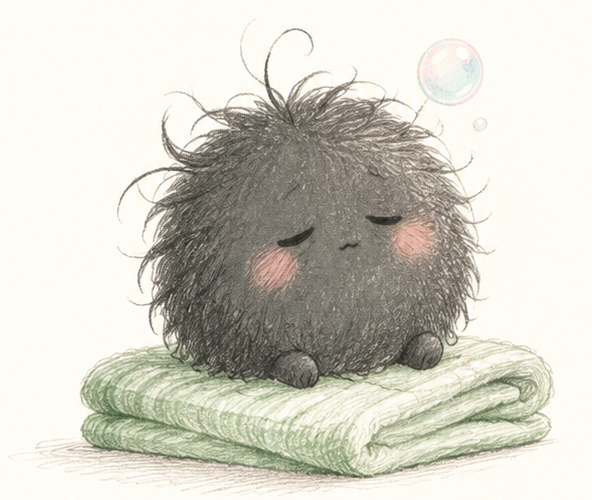
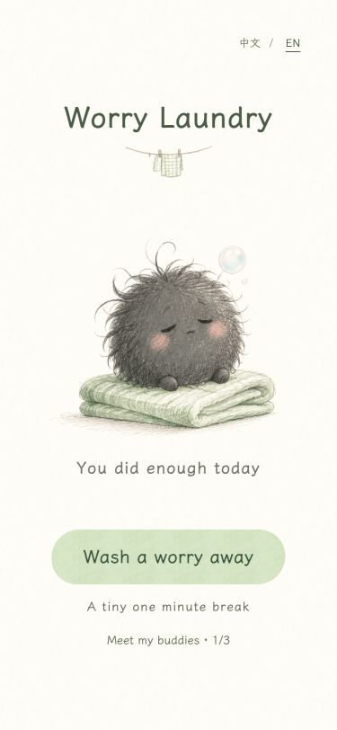
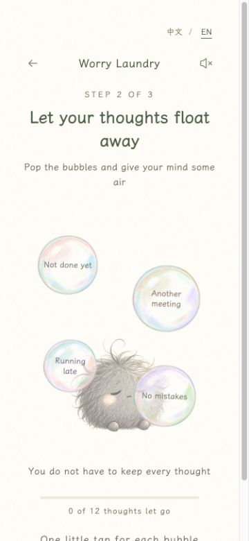

<a href="README.md">中文</a> &nbsp; · &nbsp; <strong>English</strong>

<h1 align="center">Worry Laundry</h1>

A tiny shop that accepts worries instead of coins

   
  Scan for a tiny break · Scan with WeChat or your phone camera  
  <a href="https://estherliu-lab.github.io/worry-laundry/"><strong>Open the game on your computer ↗</strong></a>
  &nbsp; · &nbsp;
  <a href="https://estherliu-lab.github.io/worry-laundry/about/">Visit our little shop ↗</a>

## Bring your tangled little day

Too many meetings, too many thoughts, or a little rain inside
Pick a worry and leave it with a sleepy grey fluff
No explaining needed

Give it a gentle rub, let your thoughts turn into bubbles, then pop them away one by one
A little spin later, a warm cat, bunny or duck is waiting to come home with you

Our house rules are simple
No rushing, no scores, and no need to be perfect
A little lighter is already lovely

## A peek inside

 &nbsp; 

Touch a little fluff, collect a new friend, and take a keepsake laundry ticket with you
A tiny one minute break, in Chinese or English, on your phone or computer

## A little note from the shop

© 2026 estherliu-lab · Worry Laundry

Enjoy the game for free and share its link
Please contact the developer before republishing, adapting or using the game content commercially
Third party fonts and other resources retain their own licenses

For feedback, permissions or copyright questions, contact the developer

**WeChat: Canaan-77**
