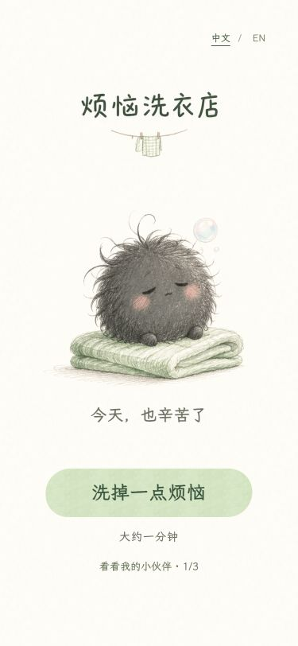
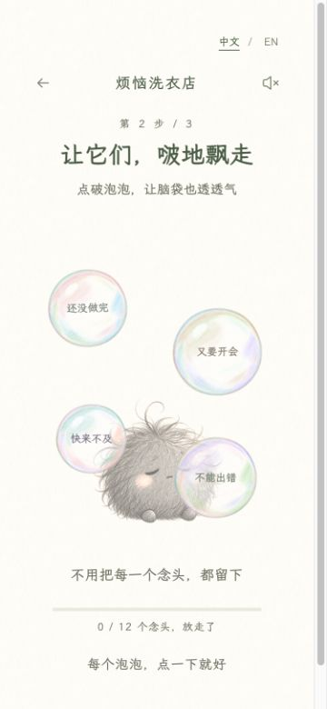

<strong>中文</strong> &nbsp; · &nbsp; <a href="README.en.md">English</a>

<h1 align="center">烦恼洗衣店</h1>

不收钱，只收一小团烦恼

   
  手机扫一扫，把小店装进口袋 · 微信扫一扫或手机相机都可以  
  <a href="https://estherliu-lab.github.io/worry-laundry/"><strong>在电脑上推门进去玩 ↗</strong></a>
  &nbsp; · &nbsp;
  <a href="https://estherliu-lab.github.io/worry-laundry/about/">逛逛小店介绍 ↗</a>

## 把今天的皱巴巴，交给我们

又要开会，想得太多，或者心里有点下雨
选一团烦恼，交给困困的灰色小毛团
不用解释，它都懂

轻轻搓一搓，把脑袋里的小剧场变成泡泡
啵，啵，啵，让它们一颗一颗飘走
再转个圈，一只暖乎乎的小猫、小兔或小鸭就洗好了

本店的规矩很简单
不催你，不打分，也不要求你变得完美
能轻一点点，就已经很好了

## 往小店里看一眼

 &nbsp; 

摸摸小毛团，收藏新伙伴，再带上一张属于你的洗衣小票
给自己一分钟的小休息，手机和电脑都能玩，中文和英文随时切换

## 小店告示

© 2026 estherliu-lab · 烦恼洗衣店

欢迎免费游玩与分享游戏链接
转载、改编或商业使用游戏内容，请先联系开发者获得许可
第三方字体等资源遵循各自授权

玩法反馈、使用授权或版权疑问，都可以联系开发者

**WeChat: Canaan-77**
